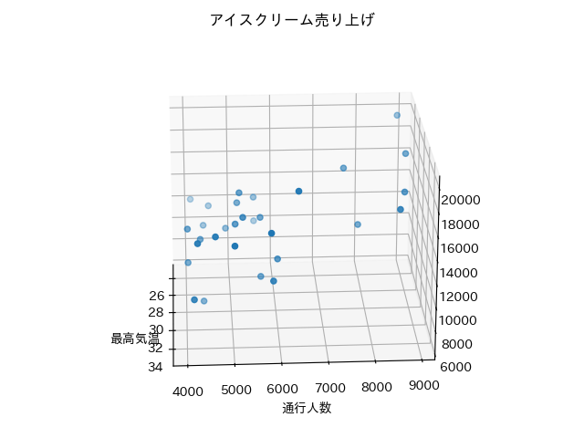
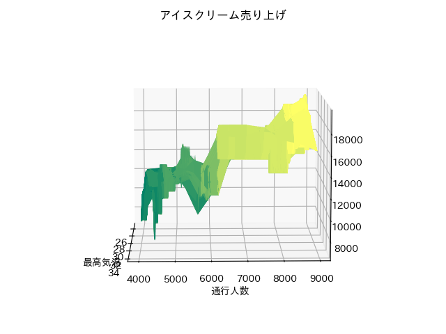

<html lang="ja">
    <head>
        <meta charset="utf-8" />
    </head>
    <body>
        <h1>
重回帰
</h1>
        <h2>なにものか？</h2>
        

            CatBoostRegressor, ExtraTreesRegressor, NGBoostRegressor を使って重回帰を試すプログラムです。 
             
            サンプルデータ：『イノベーションとAI』という本に載っていたサンプル 
            <a href="http://web.sfc.keio.ac.jp/~takefuji/ice.csv">http://web.sfc.keio.ac.jp/~takefuji/ice.csv</a> 
            ・説明変数：最高気温、通行人数 
            ・目的変数：アイスクリームの売上 
            ・お題：アイスクリーム売上＝f(最高気温, 通行人数)となる関数 f を求めよ。 
            説明変数×2種類＋目的変数×1種類なので、まずは 3次元グラフでデータを眺めてみる。 
             
             
            ・通行人数が 9,000 付近だと最高温度と売上は負の相関がありそう。 
            ・通行人数と売上は、正の相関がありそう。 
             
            ・通行人数が7,000以下では、最高温度と売上は正の相関がありそう。 
        

        <h2>環境構築方法</h2>
        

            pip install -r src\requirements.txt 
             
        

        <h2>使い方</h2>
        <h3>CatBoost Regressor</h3>
        

            ・学習～モデルのセーブ～プロット 
            　python src\train_CatBoostRegressor.py 
             
            ・モデルのロード～売上予測 
            　python src\predict_CatBoostRegressor.py (最高気温) (通行人数) [(モデルファイル名)] 
        

        <h3>ExtraTrees Regressor</h3>
        

            ・学習～モデルのセーブ～プロット 
            　python src\train_ExtraTreesRegressor.py 
             
            ・モデルのロード～売上予測 
            　python src\predict_ExtraTreesRegressor.py (最高気温) (通行人数) [(モデルファイル名)] 
        

        <h3>NGBoost Regressor</h3>
        

            ・学習～モデルのセーブ～プロット 
            　python src\train_NGBoostRegressor.py 
             
            ・モデルのロード～売上予測 
            　python src\predict_NGBoostRegressor.py (最高気温) (通行人数) [(モデルファイル名)] 
        

    </body>
</html>
